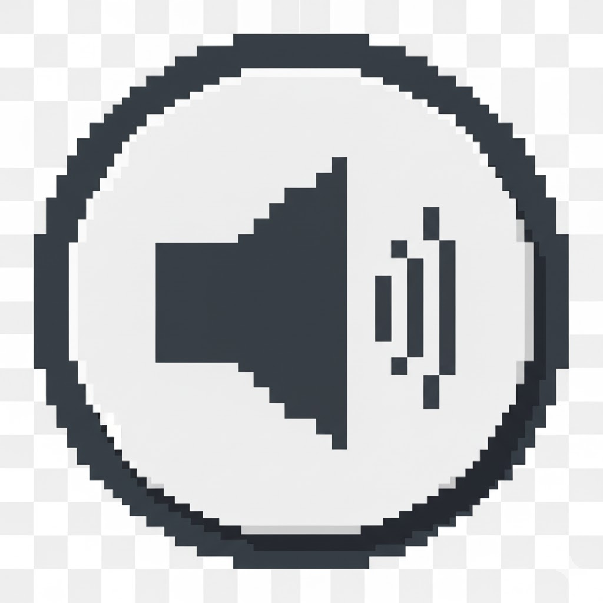

# Hackathon

# Retro Arcade

## Overview

### Purpose

### Target Audience

## User Stories/UX design

### Must-Have User Stories

### Should-Have User Stories

### Could-Have User Stories

## Design Decisions

### Wireframes

The design features:

-   **Colour palette:**
    

### Accessibility Considerations

-   **Color Contrast:**
-   **Alt Text:**
-   **Keyboard Navigation:**
-   **Responsive Design:**

## Features Implementation

### Core Features

## AI Tools Usage

### Google Gemini

### GitHub Copilot

## Testing and Validation

### Testing Results

Tested across multiple devices with Chrome DevTools for responsiveness. I used the Am I Responsive website:

![Am I Responsive - Desktop View]

![Am I Responsive - Tablet View]

![Am I Responsive - Mobile View]

![Am I Responsive - Multiple Device View]

![Am I Responsive - Responsive Layout]

### Lighthouse

### Validation

HTML and CSS passed W3C validation with no errors:

## Deployment

### Deployment Process

Deployed via GitHub Pages. Resolved broken links to ensure all external links opened correctly.

## Reflection on Development Process

### Successes

-   **AI Tools:** Enhanced development speed and design with GitHub Copilot
-   **Design:** Balanced aesthetics with accessibility.

### Challenges

### Final Thoughts

## Future Improvements

## Code Attribution

### Bootstrap Framework:

### Icons:

### External Resources:

https://youtu.be/baBq5GAL0_U?si=C7W8RKKrdUZKZG8n

https://www.youtube.com/watch?v=5IMXpp3rohQ

https://www.youtube.com/watch?v=WxeTMsaSOaA&list=WL&index=10&t=849s

### Image Attribution:

The images for the game cards and in the background, were generated using Google Gemini
