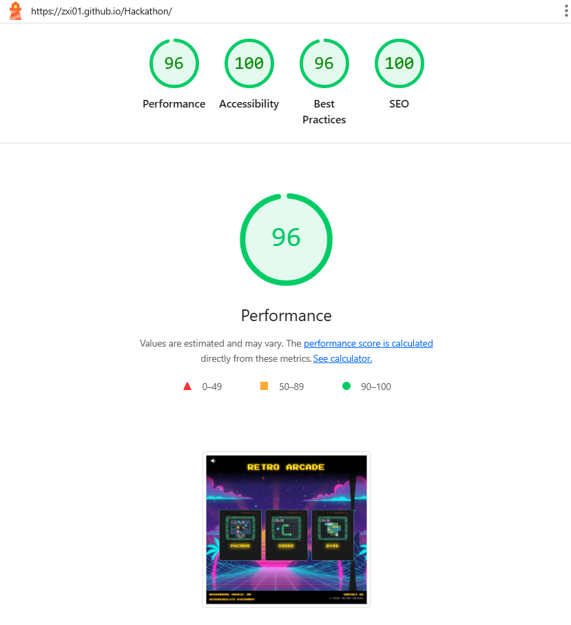
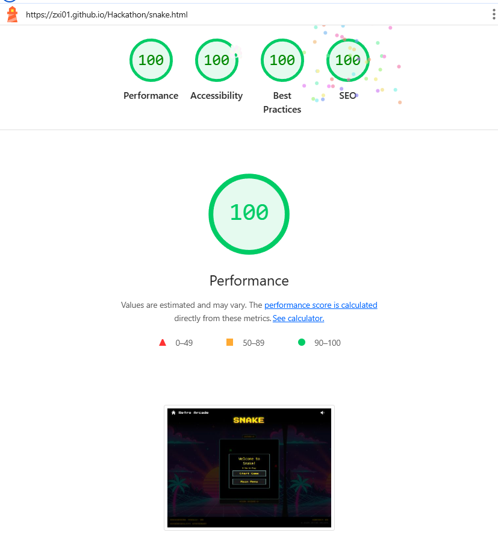

# Hackathon

# Retro Arcade

## Introduction

🎮 **Retro Arcade** is a collaborative web-based project that brings three timeless classics—Pac-Man, Snake, and 2048—into a single, accessible platform. Designed for quick play and nostalgic enjoyment, each game is built using HTML, CSS, and JavaScript, with a focus on clean design, responsive layout, and intuitive controls. Whether you're chasing high scores or reliving childhood favorites, this collection offers a fun, lightweight experience that runs smoothly in any modern browser. It's a celebration of retro gaming, teamwork, and front-end creativity.

### Project Outline

This project delivers a browser-based collection of three retro-inspired games—Pac-Man, Snake, and 2048—designed for quick play, intuitive interaction, and nostalgic appeal. Each game is self-contained yet unified under a shared visual theme and responsive layout. The codebase emphasizes modular design, clean logic, and accessibility, making it easy to expand or customize. Our goal is to provide a lightweight, engaging experience that runs smoothly across devices, while showcasing teamwork, retro game mechanics, and front-end development skills.

### Target Audience

Our project is designed for casual gamers, nostalgia enthusiasts, and anyone seeking quick, engaging gameplay experiences. We aim to appeal to players of all ages who appreciate classic mechanics with a modern twist. Whether you're a seasoned gamer looking to revisit timeless favorites or a newcomer exploring simple yet addictive games, our collection offers intuitive controls, browser-based accessibility, and a fun way to unwind or challenge your reflexes and strategy. Perfect for short breaks, classroom demos, or retro-themed events.

## UX Design

### User Stories

#### Must-Have User Stories

-   As a user, I want to easily navigate between games and the homepage, so I can switch games quickly.
-   As a user, I want the arcade to work on desktop, tablet, and mobile, so I can play anywhere.
-   As a player, I want to view my final score when the game ends, so I know how well I did.
-   As a user, I want games to load quickly and smoothly, so I don’t get frustrated waiting.
-   As a player, I want to see game titles, thumbnails, and short descriptions, so that I know what each game is about.

#### Should-Have User Stories

-   As a player, I want to hear retro-style sound effects and background music, so the arcade feels authentic.
-   As a user, I want to mute or adjust volume, so I can control the sound experience.
-   As a player, I want to rate and leave feedback on games, so I can help others discover the best ones.
-   As a player, I want to see my score while playing, so I can track my progress in real time.

#### Could-Have User Stories

-   As a user relying on accessibility features, I want to view an accessibility statement, so I know what measures the site takes to support my needs.
-   As a visually impaired user, I want to switch to a high-contrast theme, so I can clearly see text and UI elements.

## Wireframes

  
   
    

The design features:

-   **Colour palette:**

  

### Accessibility Considerations

-   **Color Contrast:**
-   **Alt Text:**
-   **Keyboard Navigation:**
-   **Responsive Design:**

## Features

### Core Features

**Homepage**

-   The homepage features a clean, retro-inspired layout designed for easy navigation and instant engagement. At its core are three vibrant game cards—Pac-Man, Snake, and 2048—each styled with bold neon accents that evoke classic arcade aesthetics. These cards serve as interactive gateways, inviting users to dive into their game of choice with a single click. The overall design balances nostalgic flair with modern simplicity, using a dark background, glowing highlights, and intuitive spacing to create a visually striking yet user-friendly experience that works seamlessly across devices.

  
  

**Navbar**

-   The site features a consistent black navigation bar across all pages, styled with a white retro pixel font and anchored by a bold title, a Home icon for quick access, and a burger menu for streamlined navigation.

  
  

**Game Page Design**

-   Each game page follows a unified design to ensure a smooth and consistent user experience. The layout includes a prominent game title, a high score tracker, lives counter (where applicable), and a current score display, all styled in a clean retro font. A "How to Play" button offers quick instructions for new users, keeping gameplay accessible. The games are rendered using HTML canvas elements, each set to the same dimensions for visual consistency and responsive performance across devices. This cohesive structure makes it easy to switch between games while maintaining a familiar interface.

  
  

**How To Play Modal**

-   Each game includes a "How to Play" modal that provides clear, concise instructions in a pop-up window, helping users quickly understand the rules and controls before diving into gameplay.

  

**Restart Modal**

-   Each game includes a restart modal that appears when gameplay ends, offering a clear prompt to start over while preserving the retro design and ensuring a smooth, user-friendly experience.

  

**Footer**

-   The footer enhances usability and inclusivity with a set of interactive features designed for accessibility and user engagement. It includes a background toggle button that allows users to switch between neon and dark modes for visual comfort, an accessibility statement outlining our commitment to inclusive design, and a contact form where players can share suggestions or report issues. Styled to match the site's retro aesthetic, the footer remains consistent across all pages, offering easy access to support.

  
  

**Contact Page**

-   The site includes a styled contact form that matches the overall visual identity and user experience. Visitors can use it to share feedback, report issues, or reach out with questions and suggestions.

  

## AI Tools Usage

-   We used AI Copilot both in the web browser and through Visual Studio Code to streamline development and enhance collaboration throughout our project. It was especially helpful for debugging tricky sections of code, suggesting fixes and improvements in real time. When we wanted to add extra features—like modals, score tracking, or canvas interactions—but weren’t sure how to integrate them smoothly, Copilot provided clear, context-aware suggestions that fit our existing structure. It also saved us time on smaller tasks like formatting, refactoring, and writing repetitive logic, allowing us to focus more on design, gameplay, and user experience. Importantly, every piece of AI-generated code was carefully read, tested, and understood before implementation to ensure compatibility with our existing codebase and prevent errors or unintended conflicts.

### Google Gemini

### GitHub Copilot

## Testing and Validation

### Testing Results

Tested across multiple devices with Chrome DevTools for responsiveness. I used the Am I Responsive website:

![Am I Responsive - Desktop View]

![Am I Responsive - Tablet View]

![Am I Responsive - Mobile View]

![Am I Responsive - Multiple Device View]

![Am I Responsive - Responsive Layout]

### Lighthouse

  
  

  
  

  
  

### Validation

HTML and CSS passed W3C validation with no errors:

  
  

  
  

  

## Deployment

### Deployment Process

Deployed via GitHub Pages. Resolved broken links to ensure all external links opened correctly.

## Reflection on Development Process

### Successes

-   **AI Tools:** Enhanced development speed and design with GitHub Copilot
-   **Design:** Balanced aesthetics with accessibility.

### Challenges

### Final Thoughts

## Future Improvements

## Code Attribution

### Bootstrap Framework:

### Icons:

  
  

### External Resources:

https://youtu.be/baBq5GAL0_U?si=C7W8RKKrdUZKZG8n

https://www.youtube.com/watch?v=5IMXpp3rohQ

https://www.youtube.com/watch?v=WxeTMsaSOaA&list=WL&index=10&t=849s

### Image Attribution:

The images for the game cards, the background and icons, were generated using Google Gemini
